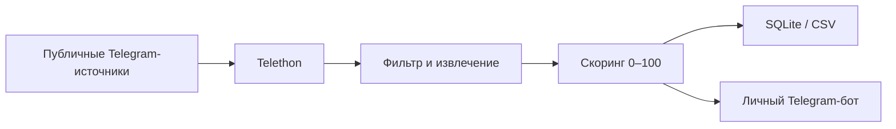

<div align="center">
  

  # LeadHawk

  **Поиск, фильтрация и доставка свежих freelance-лидов из публичного Telegram**

  [](https://www.python.org/)
  [](https://telegram.org/)
  [](https://sqlite.org/)
  [](#проверка)

  <sub>Только публичные источники · Без автоспама · С owner-only управлением</sub>
</div>

---

## Что делает LeadHawk

LeadHawk находит публичные Telegram-источники, читает свежие сообщения и
выделяет заявки на:

- сайты и лендинги;
- Telegram-ботов и Mini Apps;
- CRM и API-интеграции;
- парсеры и scraping;
- frontend и вёрстку.

Каждый лид получает категорию, бюджет, контакты и оценку качества `0–100`.
Результаты сохраняются в SQLite, экспортируются в CSV и отправляются владельцу
в личный Telegram-бот.



> [!IMPORTANT]
> Google закрыл **Custom Search JSON API** для новых клиентов. Команда
> `discover` работает только у аккаунтов с ранее выданным доступом.
> Telegram-парсер, фильтрация, база, CSV и управляющий бот работают независимо;
> модуль автоматического поиска источников нужно перевести на другого
> поискового провайдера.

## Возможности

| Возможность | Реализация |
|---|---|
| Чтение публичных каналов и чатов | Telethon user session |
| Фильтрация вакансий и нерелевантных сообщений | Ключевые слова и проектные сигналы |
| Извлечение данных | Категория, бюджет, валюта, username, телефон |
| Оценка лида | Score от 0 до 100 |
| Защита от дублей | Уникальный hash сообщения |
| Хранение | SQLite |
| Экспорт | CSV с UTF-8 BOM |
| Управление | Личный Telegram-бот на aiogram |
| Автосбор | Настраиваемый интервал |

## Быстрый старт

Требуется Python `3.11+`.

```bash
git clone https://github.com/4spanch1k/LeadHawk.git
cd LeadHawk

python3 -m venv .venv
source .venv/bin/activate
pip install -r requirements.txt

cp .env.example .env
```

Заполните `.env` своими credentials:

```dotenv
# Telegram API: https://my.telegram.org
TG_API_ID=123456
TG_API_HASH=your_api_hash
TG_PHONE=+77000000000

# Управляющий бот: https://t.me/BotFather
BOT_TOKEN=your_bot_token
BOT_OWNER_ID=123456789

# Только для существующих клиентов Custom Search JSON API
GOOGLE_API_KEY=your_google_api_key
GOOGLE_CX=your_google_cx

DATABASE_PATH=data/leadhawk.db
HOURS_LOOKBACK=24
MAX_MESSAGES_PER_SOURCE=300
REQUEST_DELAY_SECONDS=2

BOT_AUTO_RUN_INTERVAL_MINUTES=60
BOT_NOTIFICATION_MIN_SCORE=0
BOT_MAX_NOTIFICATIONS=20
```

Никогда не публикуйте `.env`, API-ключи и Telegram session-файлы.

## Первый запуск

Один раз авторизуйте Telethon. Telegram пришлёт код подтверждения:

```bash
python main.py parse
```

После авторизации запустите управляющего бота:

```bash
python main.py bot
```

Откройте своего бота в Telegram и отправьте `/start`.

## Команды Telegram-бота

| Команда | Действие |
|---|---|
| `/run` | Полный цикл: discover → parse → export |
| `/discover` | Поиск новых источников через настроенный provider |
| `/parse` | Сбор свежих лидов и отправка результатов |
| `/stats` | Статистика источников и лидов |
| `/latest` | Последние найденные лиды |
| `/export` | Получить CSV-файл |
| `/auto_on` | Включить фоновый сбор |
| `/auto_off` | Приостановить фоновый сбор |
| `/help` | Справка |

Бот принимает команды только от `BOT_OWNER_ID` и только в личном чате.

## CLI

```bash
python main.py stats      # статистика
python main.py parse      # собрать лиды
python main.py export     # создать data/leads.csv
python main.py bot        # запустить Telegram-панель

# Требует legacy-доступ к Google Custom Search JSON API
python main.py discover
python main.py run
```

## Структура

```text
LeadHawk/
├── main.py                 # CLI
├── telegram_bot.py         # Telegram-панель и уведомления
├── lead_collection.py      # единый сценарий сбора
├── google_finder.py        # поиск публичных t.me-источников
├── telegram_parser.py      # чтение сообщений через Telethon
├── lead_filter.py          # фильтрация
├── lead_extractor.py       # извлечение данных
├── scoring.py              # оценка качества
├── db.py                   # SQLite
├── exporter.py             # CSV
├── config.py               # настройки окружения
└── tests/                  # тесты
```

## Безопасность

- Используются только публичные Telegram-источники.
- LeadHawk не вступает в приватные группы и не обходит ограничения платформ.
- Автоматическая рассылка потенциальным клиентам отсутствует.
- Между запросами действуют задержки; `FloodWait` обрабатывается отдельно.
- `.env`, `sessions/`, базы, CSV и логи исключены из Git.
- Управляющий бот ограничен одним Telegram user ID.

## Проверка

```bash
pip install -r requirements-dev.txt
pytest
ruff check .
ruff format --check .
```

Ожидаемый результат:

```text
14 passed
All checks passed!
```

## Лицензии и товарные знаки

Python и логотип Python являются товарными знаками Python Software Foundation.
LeadHawk не связан с Python Software Foundation или Telegram.
